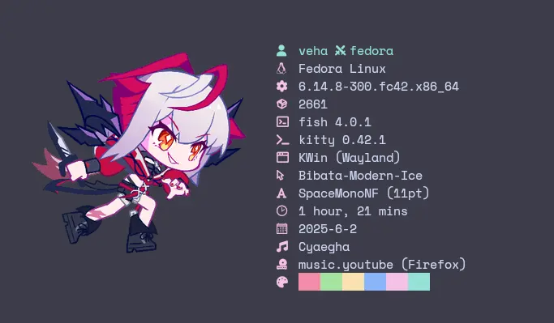

# mdfastfetch

fastfetch logo from: [Muse Dash](https://musedash.peropero.net/loading/13.gif) using `kitty-icat`.

## Install

```bash
git clone https://github.com/Veha0001/mdfastfetch ~/.local/share/fastfetch/
```

or copy presets only:

```bash
git clone https://github.com/Veha0001/mdfastfetch
cd mdfastfetch
cp -r ./presets/ ~/.local/share/fastfetch/
```

## Preview

- md/boom
  
